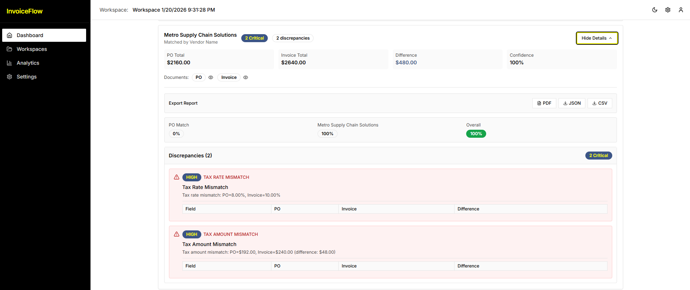
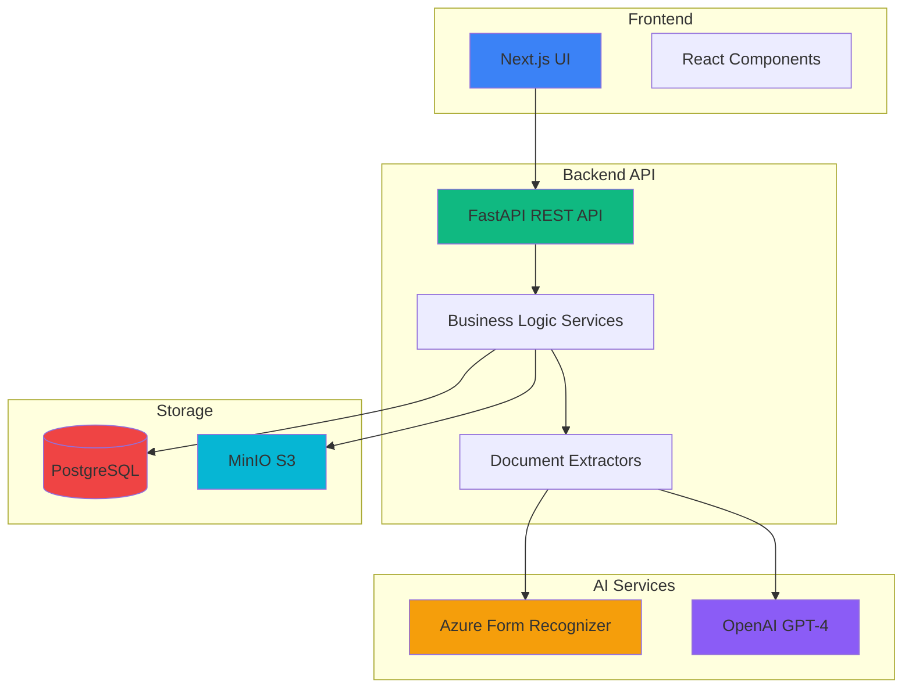

# InvoiceFlow - Document Matching & Reconciliation Platform

Automated three-way reconciliation for Purchase Orders, Invoices, and Delivery Notes using AI-powered document extraction and intelligent matching.

## Problem & Solution

**Problem**: Manual reconciliation of purchase orders, invoices, and delivery notes is time-consuming, error-prone, and doesn't scale. Finance teams struggle to:

- Match documents across different formats and vendors
- Detect discrepancies in quantities, prices, and tax calculations
- Track currency mismatches and missing line items
- Generate audit-ready reconciliation reports

**Solution**: InvoiceFlow automates the entire reconciliation workflow:

- **AI-Powered Extraction**: Uses Azure Form Recognizer and LLM to extract structured data from PDFs
- **Intelligent Matching**: Matches documents by PO number or vendor name with fuzzy matching
- **Discrepancy Detection**: Automatically flags quantity mismatches, price changes, currency differences, tax errors, and missing items
- **Three-Way Reconciliation**: Compares PO ↔ Invoice ↔ Delivery Note in a single workflow
- **Report Generation**: Produces PDF, JSON, and CSV reports with detailed discrepancy analysis

## Screenshots



The dashboard shows detailed discrepancy analysis, including tax rate mismatches, tax amount differences, and comprehensive matching results with confidence scores.

## High-Level Architecture



## Project Structure

```
InvoiceFlow/
├── backend/             # FastAPI backend
│   ├── src/
│   │   ├── api/         # API endpoints
│   │   ├── core/        # Config & DB
│   │   ├── models/      # DB models
│   │   ├── services/    # Business logic & extractors
│   │   └── main.py      # App entry
│   ├── alembic/         # Migrations
│   ├── scripts/         # Utilities
│   └── Dockerfile
│
├── frontend/            # Next.js frontend
│   ├── src/
│   │   ├── app/         # App router & pages
│   │   ├── components/  # React components
│   │   └── lib/         # Utilities
│   └── Dockerfile
│
├── docs/                # Documentation
├── docker-compose.yml   # Docker orchestration
└── README.md
```

## Tech Stack

| Layer                | Technology                    | Purpose                              |
| -------------------- | ----------------------------- | ------------------------------------ |
| **Frontend**         | Next.js 14, React, TypeScript | Modern React framework with SSR      |
| **UI Framework**     | Tailwind CSS, shadcn/ui       | Utility-first CSS, component library |
| **Backend**          | FastAPI, Python 3.11          | High-performance async API           |
| **Database**         | PostgreSQL 16                 | Relational data storage              |
| **Object Storage**   | MinIO                         | S3-compatible file storage           |
| **AI/ML**            | Azure Form Recognizer         | Document OCR & extraction            |
| **AI/ML**            | OpenAI GPT-4 (via Instructor) | LLM-enhanced extraction              |
| **PDF Processing**   | PyMuPDF (fitz)                | PDF parsing & validation             |
| **Matching**         | RapidFuzz                     | Fuzzy string matching                |
| **Infrastructure**   | Docker, Docker Compose        | Containerization                     |
| **Package Managers** | uv (Python), npm (Node)       | Dependency management                |

## Quick Start

### Prerequisites

- Docker & Docker Compose
- Azure Form Recognizer credentials
- OpenAI API key (optional, for enhanced extraction)

### Setup

1. **Clone repository**

   ```bash
   git clone https://github.com/stephaneWamba/invoiceflow
   cd InvoiceFlow
   ```

2. **Configure environment**

   ```bash
   cp backend/env.example .env
   # Edit .env with your Azure and OpenAI credentials
   ```

3. **Start services**

   ```bash
   docker-compose up -d
   ```

4. **Run migrations**

   ```bash
   docker-compose exec backend alembic upgrade head
   ```

5. **Access application**
   - Frontend: http://localhost:3100
   - Backend API: http://localhost:8100
   - MinIO Console: http://localhost:9101 (minioadmin/minioadmin)

## Documentation

- **[User Guide](docs/USER_GUIDE.md)** - How to use InvoiceFlow
- **[Architecture](docs/ARCHITECTURE.md)** - System design & components
- **[API Reference](docs/API.md)** - REST API documentation
- **[Frontend Guide](docs/FRONTEND.md)** - Frontend architecture
- **[Local Setup](docs/LOCAL_SETUP.md)** - Development setup guide

## License

MIT
